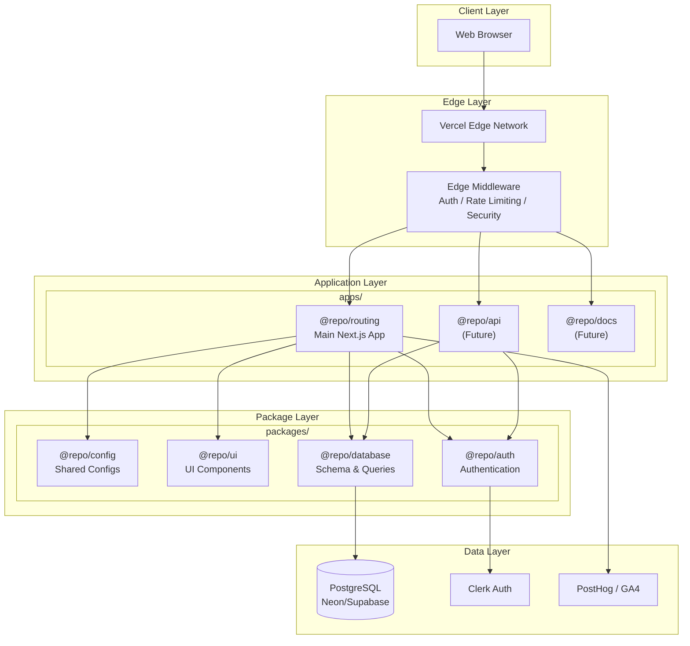

# MK3 Platform

[](https://vercel.com/new/clone?repository-url=https://github.com/mikerkeating/next-js-01)

A monorepo-based Next.js 16 platform built with TypeScript, React 19, and Tailwind CSS 4.

## Quick Start

Get running locally in under 5 minutes:

```bash
# Clone and enter directory
git clone https://github.com/mikerkeating/next-js-01.git
cd next-js-01

# Install dependencies (uses pnpm workspaces)
pnpm install

# Set up environment
cp .env.example .env.local

# Start development server
pnpm dev
```

Open [http://localhost:3000](http://localhost:3000) in your browser.

## Architecture Overview

This project uses a **monorepo architecture** powered by **Turborepo** and **pnpm workspaces** to manage multiple Next.js applications and shared packages in a single repository.



### Key Benefits

- **Code Sharing**: Shared packages eliminate duplication across applications
- **Intelligent Caching**: Turborepo caches build outputs locally and remotely
- **Atomic Changes**: Modify shared code and consuming apps in a single PR
- **Type Safety**: TypeScript types flow seamlessly between packages
- **Independent Deployments**: Each app deploys to Vercel independently

## Directory Structure

```text
mk3-platform/
├── apps/                    # Next.js applications
│   └── routing/             # Main routing app (deployed to Vercel)
│
├── packages/                # Shared packages (future)
│   └── .gitkeep            # Placeholder for shared packages
│
├── docs/                    # Project documentation
│   ├── 0-process/          # Development process guides
│   ├── 1-product/          # Product requirements (PRD, roadmap)
│   ├── 2-technical/        # Technical architecture (TAD, ADRs)
│   └── 3-epics/            # Epic and story specifications
│
├── turbo.json              # Turborepo task configuration
├── pnpm-workspace.yaml     # pnpm workspace configuration
└── package.json            # Root package.json with shared scripts
```

### Directory Purposes

| Directory | Purpose |
|-----------|---------|
| `apps/` | Next.js applications. Each app is independently deployable |
| `apps/routing/` | Main routing layer - primary Next.js application |
| `packages/` | Shared packages consumed by multiple apps (config, UI, database, auth) |
| `docs/` | Living documentation including PRD, TAD, ADRs, and story specs |
| `docs/0-process/` | Development workflow, coding standards, and contribution guides |
| `docs/1-product/` | Product requirements document and delivery roadmap |
| `docs/2-technical/` | Technical architecture document and architecture decision records |
| `docs/3-epics/` | Epic breakdowns with individual story specifications |

## Prerequisites

- **Node.js**: 24.x LTS (see `.nvmrc`)
- **pnpm**: 10.x (`npm install -g pnpm@10`)

For exact version constraints, see [canonical-versions.md](/docs/2-technical/references/canonical-versions.md).

## Common Commands

All commands run from the repository root using Turborepo for intelligent task orchestration:

| Command | Description |
|---------|-------------|
| `pnpm dev` | Start development server for all apps |
| `pnpm build` | Build all apps and packages for production |
| `pnpm lint` | Run ESLint across all workspaces |
| `pnpm lint:fix` | Run ESLint with auto-fix |
| `pnpm type-check` | Run TypeScript type checking |
| `pnpm test` | Run tests across all workspaces |
| `pnpm clean` | Remove build artifacts and node_modules |
| `pnpm format` | Format code with Prettier |
| `pnpm format:check` | Check code formatting |

### Quality Checks

Run before committing:

```bash
pnpm lint          # Must pass with 0 errors, 0 warnings
pnpm type-check    # Must pass with 0 errors
pnpm test          # Must pass all tests
pnpm build         # Must complete successfully
```

## Workspace Commands

Use `--filter` to target specific workspaces:

```bash
# Run command in specific workspace
pnpm turbo build --filter=@repo/routing

# Run command in workspace and its dependencies
pnpm turbo build --filter=@repo/routing...

# Run command in all workspaces that depend on a package
pnpm turbo build --filter=...@repo/ui

# Run dev server for specific app only
pnpm turbo dev --filter=@repo/routing

# Add a dependency to a specific workspace
pnpm add lodash --filter=@repo/routing

# Add a dev dependency to workspace root
pnpm add -D prettier -w
```

### Workspace Naming Convention

- Applications: `@repo/<app-name>` (e.g., `@repo/routing`, `@repo/api`)
- Packages: `@repo/<package-name>` (e.g., `@repo/ui`, `@repo/database`)

## Remote Caching

Turborepo supports remote caching to share build artifacts across machines and CI/CD pipelines.

### Local Authentication

To enable remote caching on your local machine:

```bash
# Login to Vercel (one-time setup)
npx turbo login

# Link the repository to your Vercel team
npx turbo link
```

After linking, your builds will automatically cache to and restore from Vercel's remote cache.

### CI/CD Configuration

For GitHub Actions and other CI environments, set the following environment variables:

```bash
TURBO_TOKEN=<your-vercel-token>
TURBO_TEAM=<your-vercel-team-slug>
```

These are automatically configured on Vercel deployments. For GitHub Actions:

1. Go to **Settings > Secrets and variables > Actions**
2. Add `TURBO_TOKEN` with a Vercel access token
3. Add `TURBO_TEAM` with your Vercel team slug

### Cache Benefits

- **Faster CI/CD**: Skip rebuilding unchanged packages
- **Team Collaboration**: Share cached artifacts across the team
- **Cost Savings**: Reduce build minutes in CI

## Environment Variables

This project uses [@t3-oss/env-nextjs](https://env.t3.gg/docs/nextjs) for type-safe environment variable validation.

### Setup

```bash
cp .env.example .env.local
```

Edit `.env.local` with your values. For local development, the default `NEXT_PUBLIC_APP_URL=http://localhost:3000` is sufficient.

### Variable Categories

| Category | Required | Description |
|----------|----------|-------------|
| Application | Yes | Base URL for the application |
| Basic Auth | No | Pre-release access protection |
| Database | Future | PostgreSQL connection via Neon/Supabase |
| Authentication | Future | Clerk authentication keys |
| Analytics | No | PostHog product analytics |
| Monitoring | No | Sentry error tracking |

### Build-Time Validation

Environment variables are validated when the application builds. To skip validation during CI builds without secrets:

```bash
SKIP_ENV_VALIDATION=true pnpm build
```

## Deployment

### Vercel Integration

**Production**: Deploys automatically on push to `development` branch

**Preview Deployments**: Each pull request receives a unique preview URL

### Deployment Architecture

```
Developer → Git Push → GitHub Actions CI → Vercel Deploy → Production
                ↓              ↓                ↓
           PR Created    Lint/Test/Build   Preview URL
                ↓              ↓                ↓
           Code Review    E2E Smoke Tests   PR Comment
                ↓              ↓                ↓
             Merge     All Checks Pass    Auto-Deploy
```

### GitHub Actions CI

The CI workflow (`.github/workflows/ci.yml`) runs on every PR and push to `development`:

| Job | Description |
|-----|-------------|
| `lint` | ESLint code validation |
| `type-check` | TypeScript compilation |
| `test` | Unit/integration tests |
| `build` | Production build |
| `e2e-smoke` | Playwright smoke tests |

## Troubleshooting

### Common Issues

| Issue | Solution |
|-------|----------|
| `pnpm install` fails | Verify Node.js 24.x and pnpm 10.x are installed |
| `pnpm dev` port in use | Kill process on port 3000 or use `PORT=3001 pnpm dev` |
| Environment validation fails | Check `.env.local` has all required variables from `.env.example` |
| Type errors on build | Run `pnpm type-check` locally to see specific errors |
| Turborepo cache miss | Run `npx turbo login && npx turbo link` to enable remote caching |
| Workspace not found | Ensure package.json has correct `name` field matching `@repo/<name>` |

### Turborepo Issues

```bash
# Clear local cache
pnpm turbo clean

# Run with verbose output
pnpm turbo build --verbosity=2

# Dry run to see what would be built
pnpm turbo build --dry-run

# Force rebuild ignoring cache
pnpm turbo build --force
```

### pnpm Issues

```bash
# Clear pnpm store
pnpm store prune

# Check why a package is installed
pnpm why <package-name>

# List all workspace packages
pnpm list -r --depth 0
```

## Documentation

| Document | Purpose |
|----------|---------|
| [Process Guide](/docs/0-process/0-process.md) | Development process and workflow |
| [Technical Architecture (TAD)](/docs/2-technical/2-tad.md) | System architecture overview |
| [Coding Standards](/docs/2-technical/references/coding-standards.md) | Code quality rules |
| [Canonical Versions](/docs/2-technical/references/canonical-versions.md) | Dependency versions |

### Architecture Decision Records

| ADR | Decision |
|-----|----------|
| [ADR-001](/docs/2-technical/adr/001-monorepo-turborepo.md) | Monorepo with Turborepo |
| [ADR-002](/docs/2-technical/adr/002-pnpm-package-manager.md) | pnpm as Package Manager |
| [ADR-003](/docs/2-technical/adr/003-nextjs-framework.md) | Next.js 16 as Framework |
| [ADR-004](/docs/2-technical/adr/004-vercel-hosting.md) | Vercel as Hosting Platform |

## API Endpoints

### Health Check

**Endpoint**: `GET /api/health`

Returns application health status for monitoring and uptime services.

```bash
curl http://localhost:3000/api/health
```

**Response**:
```json
{
  "status": "healthy",
  "timestamp": "2025-11-27T12:00:00.000Z",
  "version": "0.1.0"
}
```

## Branch Strategy

| Branch | Purpose | Protection |
|--------|---------|------------|
| `development` | Production branch | Protected - requires PR |
| `feature/*` | New features | None |
| `fix/*` | Bug fixes | None |
| `epic/*` | Epic-level work | None |

All changes must go through pull requests with:
- At least 1 approval required
- All CI status checks passing

## License

Private - All rights reserved.
