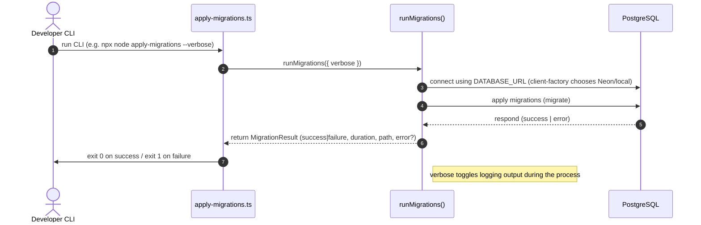

<!-- This is an auto-generated comment: summarize by coderabbit.ai -->
<!-- walkthrough_start -->

## Walkthrough

Adds a new `@repo/database` package (clients, migrations, seeding, utilities, tests), local Postgres Docker compose and test envs, CI jobs for migration-check and integration-test, multiple ESLint and package.json updates, AI sandbox permission changes, a new routing debug endpoint and proxy export changes, plus assorted import/test tidy-ups.

## Changes

| Cohort / File(s)                                                                                                                                                                                                                                                                                                                | Summary                                                                                                                                                                                                                                  |
| ------------------------------------------------------------------------------------------------------------------------------------------------------------------------------------------------------------------------------------------------------------------------------------------------------------------------------- | ---------------------------------------------------------------------------------------------------------------------------------------------------------------------------------------------------------------------------------------- |
| **New database package & public API**   `packages/database/package.json`, `packages/database/tsconfig.json`, `packages/database/src/index.ts`, `packages/database/src/*`, `packages/database/dist/*`                                                                                                                         | Adds `@repo/database` package with central re-exports: client (`db`, `Database`), client-factory, migrations, seeding framework, connection utilities, utils (ids/timestamps/soft-delete/org), seed APIs, examples and package metadata. |
| **Client factory & runtime clients**   `packages/database/src/client-factory.ts`, `packages/database/src/client.ts`, `packages/database/src/client-local.ts`                                                                                                                                                                 | Adds URL-based driver detection (`isNeonUrl`, `isLocalPostgresUrl`, `getDatabaseType`) and implementations for local postgres.js client and Neon HTTP client; exports `db` instance and related types.                                   |
| **Connection utilities**   `packages/database/src/connection.ts`, `packages/database/src/connection.test.ts`                                                                                                                                                                                                                 | Adds health-check (`checkDatabaseHealth`), retry wrapper (`withRetry`), `ConnectionError` with codes and unit tests covering timeouts, latency and retry behaviour.                                                                      |
| **Migrations & CLI tooling**   `packages/database/src/migrate.ts`, `packages/database/drizzle.config.ts`, `packages/database/scripts/*.ts`, `packages/database/examples/*`, `packages/database/scripts/*.test.ts`                                                                                                            | Implements migration runner (`runMigrations`, `getMigrationsPath`, `MigrationError`), Drizzle config requiring DATABASE_URL, CLI scripts (generate/apply/rollback/reset/verify), examples and tests.                                     |
| **Seeding framework**   `packages/database/src/seed/*`, `packages/database/src/seed/*.test.ts`, `packages/database/src/seed/run.ts`                                                                                                                                                                                          | Adds seed framework with config, deterministic factories, runner, logger/progress tracker, CLI runner and tests.                                                                                                                         |
| **Utilities: ids, timestamps, soft-delete, org-context**   `packages/database/src/utils/*`, `packages/database/src/utils/*.test.ts`                                                                                                                                                                                          | New utilities and tests: ID generation/validation (cuid2), timestamp helpers, soft-delete helpers, org-scoped utilities and a utils index re-exporting them.                                                                             |
| **Test infra & integration tests**   `packages/database/src/__tests__/**/*`, `packages/database/.env.test`, `packages/database/vitest*.ts`                                                                                                                                                                                   | Adds unit and integration test suites, test helpers, integration setup, test-client (Neon/local), and Vitest configs for unit and integration testing.                                                                                   |
| **Docker Compose & env examples**   `docker-compose.yml`, `.env.example`, `packages/database/.env.test`                                                                                                                                                                                                                      | Adds docker-compose for local Postgres (postgres:16-alpine, volume, healthcheck) and updates `.env.example` with local and Neon examples plus dedicated test DB guidance.                                                                |
| **CI/CD workflow changes**   `.github/workflows/ci.yml`, `.github/workflows/pr.yml`                                                                                                                                                                                                                                          | Adds `migration-check` and `integration-test` jobs; integration-test runs a PostgreSQL service container; PR workflow updated so e2e-smoke depends on the new jobs.                                                                      |
| **Root & per-package ESLint configs / package manifests**   `eslint.config.js`, `apps/docs/eslint.config.js`, `packages/*/eslint.config.js`, root `package.json`, `packages/config/package.json`, `apps/docs/package.json`, `packages/middleware/package.json`, `packages/testing/package.json`, `apps/routing/package.json` | Adds root and package-level flat ESLint configs, bumps ESLint/tooling and resolver deps, and adds `"type": "module"` where applicable.                                                                                                   |
| **AI sandbox settings**   `.claude/settings.json`                                                                                                                                                                                                                                                                            | Removes many `pnpm run-*` allow entries, adds `Bash(mkdir *)`, `WebFetch`, `WebSearch`, and enables `allowOutbound: true` in sandbox/network.                                                                                            |
| **Routing proxy & debug endpoint**   `apps/routing/proxy.ts`, `apps/routing/src/app/api/debug-env/route.ts`                                                                                                                                                                                                                  | Reworks proxy exports (now a wrapper function and exported `config`), removes exported shouldBypassAuth, adds `/api/debug-env` route exposing masked BASIC_AUTH env details for debugging.                                               |
| **Docs & minor app tweaks**   `apps/docs/app/[[...mdxPath]]/page.tsx`, `apps/docs/app/layout.tsx`, `apps/docs/package.json`                                                                                                                                                                                                  | Minor import reorders, lint suppression for MDX component extraction, ESM/package changes and ESLint tooling addition for docs app.                                                                                                      |
| **Misc tests & mocks normalisations**   `packages/testing/src/mocks/*`, `packages/testing/src/*`                                                                                                                                                                                                                             | Small tidy-ups: coerced id to string, deduplicated imports, reorder type imports to avoid ordering issues; removed obsolete proxy test file.                                                                                             |

## Sequence Diagram(s)

